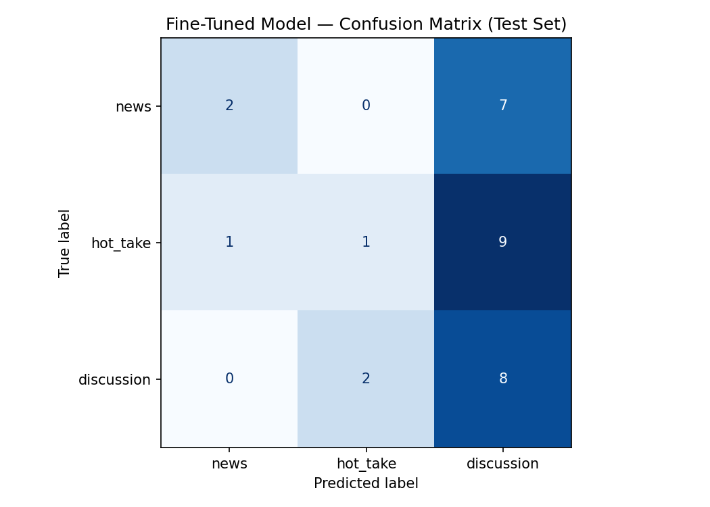

# Smash Bros Post Classifier

## Project Summary

This project fine-tunes a DistilBERT model to classify the posts from r/smashbros r/NintendoSwitch, r/supersmashbros, r/SuperSmashBros. into three categories: news, hot_take, and discussion. The main goal was to automatically identify
what kind of post a user is making in the Smash Bros community.

## Label Definitions

- **news**: Posts that provide information about tournaments and results, annoucements, developer news, character reveals.
- **hot_take**: Bold, emotional and controversial opinion that takes our attantion or spark debate. Occassionaly in those posts includes videos
- **discussion**: Casual, personal posts where users ask questions and express a feeling in the moment

## Evaluation Results

### Baseline (Llama-3.3-70b via Groq)

| Label                | Precision | Recall | F1    |
| -------------------- | --------- | ------ | ----- |
| discussion           | 1.00      | 0.57   | 0.73  |
| hot_take             | 0.64      | 0.64   | 0.64  |
| news                 | 0.62      | 0.80   | 0.70  |
| **Overall accuracy** |           |        | 0.679 |

### Fine-Tuned (DistilBERT)

| Label                | Precision | Recall | F1    |
| -------------------- | --------- | ------ | ----- |
| discussion           | 0.60      | 0.33   | 0.43  |
| hot_take             | 0.00      | 0.00   | 0.00  |
| news                 | 0.40      | 1.00   | 0.57  |
| **Overall accuracy** |           |        | 0.433 |

---

## Confusion Matrix (Fine-Tuned Model)

|            | discussion | hot_take | news |
| ---------- | ---------- | -------- | ---- |
| discussion | 3          | 0        | 6    |
| hot_take   | 2          | 0        | 9    |
| news       | 0          | 0        | 10   |

---

## Wrong Predictions Analysis

--- #1 ---
Text: We all know that Mr. Game & Watch is actually a 3D model, but scaled to appear 2D in all the Smash games he’s in, but since in Ultimate he completely changes design when he does an attack, does that m...
True: hot_take
Predicted: discussion (confidence: 0.36)

--- #2 ---
Text: I don't know what I hate more about Shulk's final smash: It quite literally spoils the game Said spoiler was an unnecessary addition which also undermines how the attack actually works. Dunba...
True: hot_take
Predicted: discussion (confidence: 0.36)

--- #3 ---
Text: I just don't think these three hold the relevance they once did, and I'd even be arguing Fox to be in this boat if not for the Remake/Galaxy Movie. Who is your vote if that comes to pass?
True: hot_take
Predicted: discussion (confidence: 0.36)

--- #4 ---
Text: UPDATED 7:30 AM EST 4/20/2015 THANK YOU ALL FOR THE HELP! Smashboards has a running list DEFINITIONS "(UNCONFIRMED)" means more testing/users are need to verify. "CONFIRMED" text is rem...
True: news
Predicted: discussion (confidence: 0.35)

--- #5 ---
Text: Compilation Imgur Album of August 29th News - BEWARE Leaks are placed at the beginning of the album. Why did this subreddit explode today? Here's a quick summary for major Smash related news. ...
True: news
Predicted: discussion (confidence: 0.34)

--- #6 ---
Text: Good god. Im going to whine like a baby for a minute because im SO FRUSTRATED. I practice about 2 hours a day the last few months since I started playing again. (Hadn't played since 2019). I watch ton...
True: hot_take
Predicted: discussion (confidence: 0.38)

--- #7 ---
Text: Patch Notes for your Main Thought this might be fun - how buffed or nerfed did your main get? Would you want it as an actual patch?
True: news
Predicted: discussion (confidence: 0.36)

--- #8 ---
Text: Hola alguien que me pueda pasar un pack ya configurato de mods para ryujinx es para smash bros ultimate (no le se mucho a eso y no cuento con mucho tiempo para andar checking cual jala y cual no) 😭 Lo...
True: discussion
Predicted: hot_take (confidence: 0.35)

--- #9 ---
Text: SORA FROM KINGDOM HEARTS HOLY MOTHER OF MARIO Just announced at The Final Mr. Sakurai Presents DLC Fighter Announcement Picture Details: He will have both his English and Japanese voice . ...
True: news
Predicted: discussion (confidence: 0.36)

--- #10 ---
Text: Since Nintendo has taken away our god-given right to taunt online, falcon dittos haven't been the same because we haven't been able to start with the traditional “show me your moves” from both players...
True: discussion
Predicted: hot_take (confidence: 0.35)

--- #11 ---
Text: I want Tails so much man
True: hot_take
Predicted: news (confidence: 0.34)

--- #12 ---
Text: 100% skill, no BS.
True: hot_take
Predicted: discussion (confidence: 0.34)

--- #13 ---
Text: Ultimate should be the last traditional smash game (for at least 2 or 3 generations) and they should do other takes on the idea, most likely a Mario kart like thing, but maybe a traditional platformer...
True: hot_take
Predicted: discussion (confidence: 0.37)

--- #14 ---
Text: This is especially the case with the image shown here as the “leaker” is extremely unreliable and has often got information drastically incorrect in the past. The only stuff the leaker has gotten corr...
True: news
Predicted: discussion (confidence: 0.36)

--- #15 ---
Text: Hello r/smashbros , At the title suggested the subreddit will be locked for the duration of the Nintendo Direct but there's more. 30 mins before and 30 mins- 1hr (30 mins min but may be as long as ...
True: news
Predicted: discussion (confidence: 0.35)

## Sample Classifications

| Text | True Label | Predicted | Confidence |
|-------------------------------------|------------|------------|------------||
| SORA FROM KINGDOM HEARTS HOLY MOTHER OF MARIO Just announced | news | discussion | 0.36 |
| Hello r/smashbros , At the title suggested the subreddit will | news | discussion | 0.35 |
| "Good god. Im going to whine like a baby for a minute because im SO FRUSTRATED" | hot_take | discussion | 0.38 |

Reason why I got these because it got comfuse with news nad discussion because both of them seem to be casual posts than different types of post. Same applies to hot_take and discussion because it got totally confused with discussion because they are both personal and casual posts.

## Reflection

Through this project it was to create the project with using the external sources especially with collecting the data. But with help with these examples and help with Ai companione with errors I accomplish to complete this project.

## Spec Reflection

The spec guided me to check label balance before training, which
helped me catch that I only had 3 news posts early on and fix it
before it became a model problem. One way I diverged from the spec
was collecting data from two subreddits (r/smashbros and
r/SmashBrosUltimate) instead of one community, because I couldn't
find enough balanced examples from a single source.

## AI Tool Plan

### Label stress-testing

I will use Claude to help wth my label definitions and edge case description and ask it to
generate 10 posts sitting at the boundary between `label_one` and `label_two`.
If I can't cleanly classify all 10, I'll revise the definitions before annotating.

### Annotation assistance

- I will collect manually these example and would not use an LLM to pre-label examples

### Failure analysis

After evaluation I'll give Claude my list of misclassified examples and ask it
to identify patterns (e.g., "does the model consistently confuse X for Y when
the post is short?"). I'll verify any pattern it flags by manually checking at
least 5 examples that fit the pattern before including it in my write-up.
